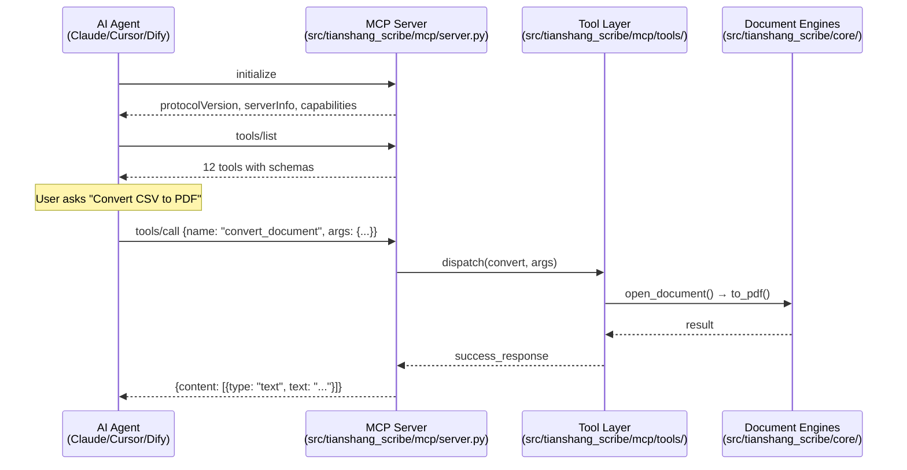
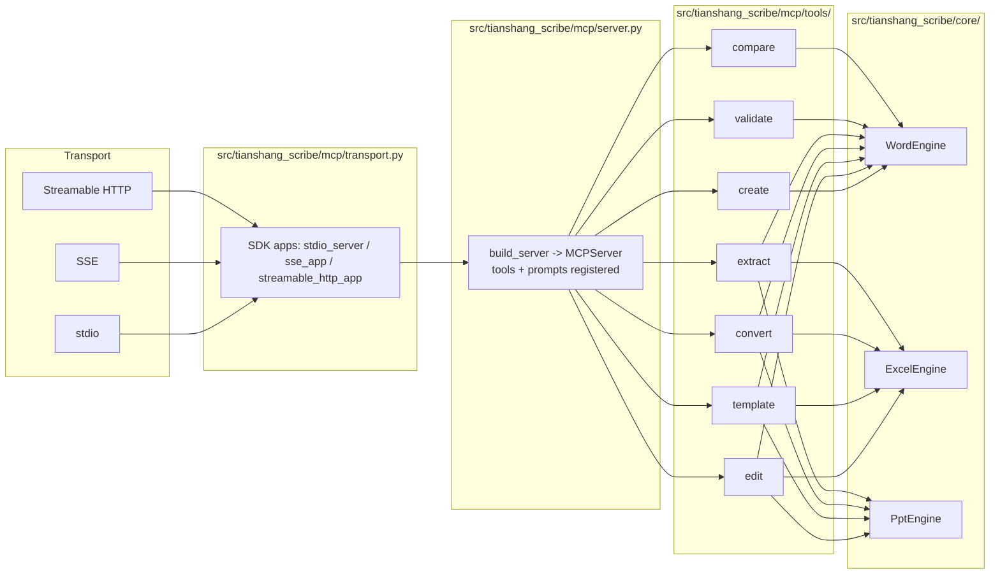

# TianshangScribe MCP Server

> [中文版](./README.zh-CN.md)

MCP (Model Context Protocol) server for Office document processing. Enables AI Agents to **create**, **edit**, **fill templates**, **convert**, and **extract data** from Word, Excel, and PowerPoint documents — with native LaTeX-style formatting and mathematical formula support.

Built on the **official MCP Python SDK** (`mcp>=2.0`, `mcp.server.mcpserver.MCPServer`). Tool schemas are derived automatically from each tool function's `Annotated` signature. Transports (stdio / SSE / Streamable HTTP) are wired in `src/tianshang_scribe/mcp/transport.py`; auth, rate limiting, and metrics are applied as middleware.


> **Warning: Unstable API \u2014 breaking changes expected**
>
> This project is pre-1.0 (0.x). CLI options, MCP tool signatures, template syntax
> and output formats are **not frozen** and may change. Breaking changes are
> announced in the CHANGELOG at least one release in advance with a migration
> guide. Pin to a specific version for production use.

## Quick Start

```bash
# Install
git clone https://github.com/Tianshang301/TianshangScribe.git
cd TianshangScribe
pip install -e ".[dev]"

# Test
python tests/integration/mcp/mcp_stdio_smoke.py

# Use with Claude Code / Cursor
# Add to your MCP config:
```

```json
{
  "mcpServers": {
    "tianshang-scribe": {
      "command": "python",
      "args": ["-m", "tianshang_scribe.mcp.server"],
      "cwd": "/path/to/TianshangScribe"
    }
  }
}
```

## Tools

### 1. `create_office_document`

Create Word, Excel, or PowerPoint documents with structured content.

```
Agent says:  "Generate a Q3 financial report"
Tool calls:  create_office_document(format="docx", content=[...])
```

**Parameters**

| Parameter | Type | Required | Description |
|-----------|------|----------|-------------|
| `format` | `"docx"` \| `"xlsx"` \| `"pptx"` | Yes | Output document format |
| `content` | `array` of ContentBlock | Yes | Ordered content blocks |
| `style` | `string` | No | Global style: `"font=Times,size=14,bold,color=FF0000"` |
| `template_data` | `object` | No | Key-value pairs to fill `{{placeholder}}` |
| `metadata` | `object` | No | Document properties: `{"title": "...", "author": "..."}` |
| `output_path` | `string` | No | Output file path (auto-generated if omitted) |
| `options` | `object` | No | `{"dry_run": true, "backup": true}` |

**ContentBlock types**

| `type` | Fields | Description |
|--------|--------|-------------|
| `paragraph` | `text`, `style` | Formatted text. Supports `\bfseries{}`, `$...$`, etc. |
| `heading` | `text`, `level` (1-6), `style` | Section heading |
| `formula` | `text` | LaTeX math formula — rendered as native OMML |
| `table` | `rows` (2D array) | Data table |
| `image` | `path` | Insert image from file |
| `page_break` | — | Page break |

**Example**

```json
{
  "format": "docx",
  "content": [
    {"type": "heading", "text": "Executive Summary", "level": 1},
    {"type": "paragraph", "text": "\\bfseries{Revenue:} \\color{0000FF}{$12.5M}. Growth: \\itshape{15.3%}."},
    {"type": "formula", "text": "\\sum_{i=1}^{n} x_i = \\frac{n(n+1)}{2}"},
    {"type": "table", "rows": [["Q1", "$3.5M"], ["Q2", "$4.2M"], ["Q3", "$4.8M"]]},
    {"type": "page_break"},
    {"type": "heading", "text": "Appendix", "level": 2}
  ],
  "metadata": {"title": "Q3 Report", "author": "AI Agent"}
}
```

### 2. `edit_office_document`

Modify an existing document with sequence of operations.

**Operation types**

| `action` | Key Fields | Description |
|----------|-----------|-------------|
| `replace` | `old_text`, `new_text`, `regex` | Find and replace text |
| `delete` | `target`, `regex` | Delete content |
| `modify` | `old_text`, `new_text` | Modify content (non-regex) |
| `style` | `style`, `apply_all` | Set style on all runs |
| `add` | `text`, `column` | Add text (Excel column support) |
| `clear` | — | Clear cell content |

```json
{
  "input_path": "report.docx",
  "operations": [
    {"action": "replace", "old_text": "2025", "new_text": "2026"},
    {"action": "style", "style": "font=Times New Roman,size=12", "apply_all": true}
  ]
}
```

### 3. `fill_template`

Fill placeholders in a template document with structured data. Supports nested keys (`{{user.name}}`) and loops (`{{#each items}}...{{/each}}`).

```json
{
  "template_path": "invitation.docx",
  "data": {
    "name": "Dr. Smith",
    "event": "AI Summit",
    "date": "2026-09-15"
  }
}
```

### 4. `convert_document`

Convert between formats.

| From | To | Supported |
|------|----|-----------|
| `docx` | `pdf`, `md`, `html` | All |
| `xlsx` | `pdf`, `csv`, `json`, `html` | All |
| `pptx` | `pdf` | Yes |

```json
{
  "input_path": "report.docx",
  "target_format": "pdf",
  "output_path": "report.pdf"
}
```

### 5. `extract_document_data`

Extract content from a document.

| `mode` | Returns |
|--------|---------|
| `metadata` | Author, title, subject, keywords |
| `text` | Full text content with block count |
| `structure` | Paragraphs/sections (Word), sheets (Excel), slides (PPT) |

```json
{
  "input_path": "report.docx",
  "mode": "text"
}
```

### 6. `validate_template`

Check a template against a data shape *before* filling, reporting which placeholders are missing.

```json
{
  "template_path": "invitation.docx",
  "data": {"name": "Dr. Smith", "event": "AI Summit"}
}
```

### 7. `compare_documents`

Extract and diff the text content of two documents (any of Word/Excel/PPT in any combination).

```json
{
  "path1": "report.docx",
  "path2": "report_old.docx"
}
```

### 8. `create_excel_workbook`

Create a new .xlsx from typed sheet specs (headers, rows, formulas, freeze, formats, column widths).

```json
{
  "output_path": "report.xlsx",
  "sheets": [
    {
      "name": "Data",
      "headers": ["name", "score"],
      "rows": [["alice", 10], ["bob", 20]],
      "formulas": {"C1": "=SUM(B2:B3)"},
      "number_format": "B2:B3=0.00"
    }
  ]
}
```

### 9. `edit_excel_workbook`

Typed Excel operations: `write_cell`, `set_formula`, `freeze_panes`, `add_chart`, `conditional_format`, `data_validation`, `add_table`, `sort`, `add_sheet`, `set_range_style`, `number_format`. Overwrites the input in place unless `output_path` is set.

```json
{
  "input_path": "report.xlsx",
  "operations": [
    {"action": "write_cell", "cell": "B3", "value": 30, "sheet_name": "Data"},
    {"action": "add_sheet", "sheet_name": "Summary"}
  ]
}
```

### 10. `create_presentation`

Create a new .pptx from typed slide specs (layout, title, bullets, text boxes, tables, charts, pictures, notes, transitions).

```json
{
  "output_path": "deck.pptx",
  "slides": [
    {"title": "Q3 Review", "bullets": ["Revenue +12%", "Churn -2%"], "layout": "Title and Content"}
  ]
}
```

### 11. `edit_presentation`

Typed PPT operations: `add_slide`, `add_text`, `replace_text`, `add_table`, `add_chart`, `add_picture`, `add_shape`, `apply_layout`, `set_transition`, `add_notes`. Overwrites the input in place unless `output_path` is set.

```json
{
  "input_path": "deck.pptx",
  "operations": [
    {"action": "add_slide", "layout": "Title and Content"},
    {"action": "add_notes", "slide_index": 1, "notes": "Pause here for questions"}
  ]
}
```

### 12. `analyze_excel_data`

Read-only workbook profiling: per-sheet row/column counts, headers, inferred column types (numeric min/max/mean, categorical values), null counts, sample rows, and duplicate-row detection.

```json
{
  "input_path": "report.xlsx"
}
```

## LaTeX Markup Reference

All tools accept LaTeX-style markup in `text` fields:

| Markup | Effect |
|--------|--------|
| `\bfseries{text}` | **Bold** |
| `\itshape{text}` | *Italic* |
| `\underline{text}` | Underline |
| `\scshape{text}` | Small Caps |
| `\color{FF0000}{text}` | Colored text |
| `\fontsize{24}{text}` | Font size (pt) |
| `\fontfamily{Arial}{text}` | Specific font |
| `\heading{N}{text}` | Heading level N |
| `\newpage` | Page break |
| `\centering{...}` | Center align |
| `$E=mc^2$` | Inline math |
| `$$x=1$$` | Display math |

## Error Handling

All tools return structured error responses:

```json
{
  "success": false,
  "error_code": 1002,
  "error_message": "The document is password-protected.",
  "suggested_fix": "Provide the password or unlock the document first.",
  "retryable": true
}
```

**Error codes**

| Code | Name | Retryable |
|------|------|-----------|
| 0 | SUCCESS | — |
| 1001 | DOCUMENT_NOT_FOUND | No |
| 1002 | DOCUMENT_LOCKED | Yes |
| 1003 | UNSUPPORTED_FORMAT | No |
| 1004 | TEMPLATE_ERROR | Yes |
| 1005 | CONVERSION_FAILED | Yes |
| 1006 | INVALID_PARAMETER | No |
| 9999 | INTERNAL_ERROR | No |

## Dry Run & Backup

All tools support `options`:

```json
{
  "options": {
    "dry_run": true,
    "backup": true,
    "deterministic_id": "uuid-v4"
  }
}
```

- `dry_run`: Preview planned changes without writing files
- `backup`: Create `.bak` copy before modifying
- `deterministic_id`: Trackable operation ID for audit

## Transport Modes

### stdio (default)
For local Agent tools (Claude Code, Cursor):
```json
{
  "mcpServers": {
    "tianshang-scribe": {
      "command": "python",
      "args": ["-m", "tianshang_scribe.mcp.server"]
    }
  }
}
```

### SSE (HTTP)
For cloud Agent platforms (Dify, Coze, FastGPT):
```bash
python -m tianshang_scribe.mcp.server --transport sse --host 0.0.0.0 --port 8080
```
```json
{
  "mcpServers": {
    "tianshang-scribe": {
      "url": "http://localhost:8080/sse",
      "transport": "sse"
    }
  }
}
```

SSE mode endpoints (official SDK):
- `GET  /sse`           — SSE event stream (with `Accept: text/event-stream`)
- `POST /message?session_id=X` — JSON-RPC request (returns `202 Accepted`, response delivered over the SSE stream)

### Streamable HTTP (MCP 2025-03-26)

The current recommended HTTP transport — a single JSON-RPC endpoint that can return responses either in-body or as a stream:

```bash
python -m tianshang_scribe.mcp.server --transport streamable-http --host 0.0.0.0 --port 8080
```
```json
{
  "mcpServers": {
    "tianshang-scribe": {
      "url": "http://localhost:8080/mcp",
      "transport": "streamable-http"
    }
  }
}
```

## Agent Integration Guide

How AI agents discover and call TianshangScribe tools in practice.

**Protocol flow:**
1. Agent sends `initialize` → server responds with server info & protocol version
2. Agent sends `tools/list` → server responds with 12 tools and their schemas
3. User makes a request → Agent selects tool + fills parameters
4. Agent sends `tools/call` → server executes and returns result
5. Agent presents result to user in natural language

> See the [Architecture](#architecture) section below for Mermaid diagrams.

### stdio Mode (Local)

#### Claude Code

**Config file**: `%USERPROFILE%\.claude.json` (global) or `.claude/mcp.json` (per-project)

```json
{
  "mcpServers": {
    "tianshang-scribe": {
      "command": "python",
      "args": ["-m", "tianshang_scribe.mcp.server"],
      "cwd": "F:\\Projects\\Project20"
    }
  }
}
```

> `cwd` **must** point to the project root so Python can find the `src/tianshang_scribe/` modules. On Linux/macOS use forward slashes: `"/home/user/TianshangScribe"`.

**Verify**: Restart Claude Code. In the chat, type:

> "What tools do you have available?"

Claude should list 12 tools including `create_office_document`.

**Try it**:

> "Use create_office_document to make a docx with one heading 'Hello' and one paragraph 'World'"

#### Cursor

**Config file**: `.cursor/mcp.json` (project root)

```json
{
  "mcpServers": {
    "tianshang-scribe": {
      "command": "python",
      "args": ["-m", "tianshang_scribe.mcp.server"],
      "cwd": "/absolute/path/to/TianshangScribe"
    }
  }
}
```

**Verify**: `Ctrl+Shift+P` → "MCP: List Tools" → should show 12 tools.

#### VS Code (with MCP extension)

**Config file**: `.vscode/mcp.json`

Same JSON as Cursor. Install an MCP-compatible extension first.

### SSE Mode (Cloud)

#### Start the Server

```bash
cd TianshangScribe
python -m tianshang_scribe.mcp.server --transport sse --host 0.0.0.0 --port 8080
```

- `--host 0.0.0.0` for public access; use `127.0.0.1` for local-only
- `--port 8080` (customizable)

#### Verify the SSE Endpoint

```bash
# Terminal 1: start server
python -m tianshang_scribe.mcp.server --transport sse --port 8080

# Terminal 2: test SSE connection
curl -N "http://localhost:8080/sse"
# Expected output:
#   event: endpoint
#   data: http://localhost:8080/message?session_id=abc123...

# Test JSON-RPC via POST
curl -X POST "http://localhost:8080/message?session_id=abc123..." \
  -H "Content-Type: application/json" \
  -d '{"jsonrpc":"2.0","id":1,"method":"tools/list","params":{}}'
# Expected: JSON response with 12 tools
```

#### Dify

1. Go to **Tools → MCP Tools → Add**
2. Select **SSE** transport
3. Enter URL: `http://your-server:8080/sse`
4. Click **Test Connection** → should discover 12 tools
5. Use in Workflow: drag `create_office_document` into a node

#### Coze / FastGPT

In the plugin/tool marketplace, add an **MCP Server** with:
- **URL**: `http://your-server:8080/sse`
- **Transport**: SSE

The platform will auto-discover the 12 tools via SSE handshake.

### Verification

```bash
# stdio protocol handshake (simulates an Agent)
python tests/integration/mcp/mcp_stdio_smoke.py    # 7/7 tests: initialize → list → call → result

# SSE transport layer
python tests/integration/mcp/test_sse.py       # 3/3 tests: lifecycle, rejected session, CORS

# Full Agent simulation — 11 end-to-end scenarios:
#   create document → edit → fill template → convert → extract
python tests/integration/mcp/mcp_agent_sim.py     # 11/11 scenarios
```

### Common Issues

| Problem | Cause | Solution |
|---------|-------|----------|
| "No MCP server found" in Claude | Wrong `cwd` or Python environment | Verify `python -m tianshang_scribe.mcp.server` runs standalone from project root |
| `ImportError: No module named 'src'` | Not in project root | Set `cwd` to TianshangScribe directory, or `pip install -e .` |
| Dify doesn't discover tools | Server not reachable | Test with `curl http://.../sse` first; check firewall/port |
| SSE connection refused | Wrong host or port | Use `--host 0.0.0.0` for remote access |
| CORS error in browser | Missing CORS headers | HTTP transports include built-in CORS; pass `--cors-origin` (or `TIANSHANG_SCRIBE_CORS_ORIGINS`) to add an allowlist |
| Auth required on HTTP | `401` on `/message` | Set `TIANSHANG_SCRIBE_API_KEYS` (comma-separated) or `--auth-token`; send `Authorization: Bearer <key>` |
| HTTP responses rejected | Streamable HTTP clients must use MCP 2025-03-26 | Use a client/SDK version that supports Streamable HTTP, or fall back to `--transport sse` |
| "CONVERSION_FAILED" on PDF | No PDF engine | Install `office2pdf` (~2MB) or LibreOffice |
| Tool returns "DOCUMENT_NOT_FOUND" | Wrong file path | Use absolute paths or paths relative to `cwd` |

### Architecture





**Key design points:**
- **Official SDK** — built on `mcp.server.mcpserver.MCPServer`; tool `inputSchema`s are derived from the `Annotated` function signatures
- **Stateless tools** — each `tools/call` is independent, enabling horizontal scaling
- **Transport-agnostic** — one server instance served over stdio, SSE, or Streamable HTTP via `src/tianshang_scribe/mcp/transport.py`
- **Hardening** — Bearer-token auth, token-bucket rate limiting, and Prometheus-style metrics applied as ASGI middleware (`src/tianshang_scribe/mcp/transport.py`)
- **Protocol**: MCP 2024-11-05 (stdio / SSE) and 2025-03-26 (Streamable HTTP)

## License

Apache-2.0
