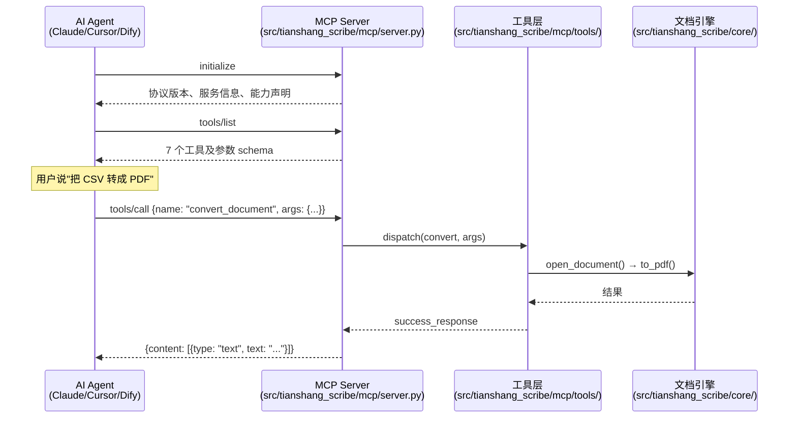
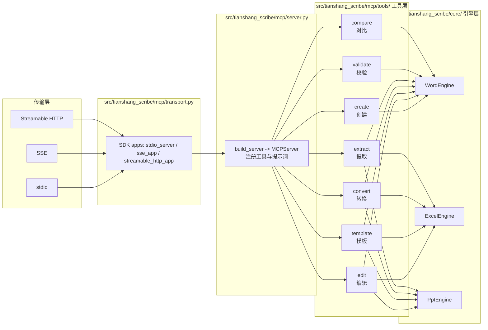

# TianshangScribe MCP Server

> [English](./README.md)

MCP（Model Context Protocol）服务端，用于 Office 文档处理。让 AI Agent 能**创建**、**编辑**、**模板填充**、**格式转换**和**数据提取** Word、Excel、PowerPoint 文档，原生支持 LaTeX 样式标记和数学公式渲染。

基于**官方 MCP Python SDK**（`mcp>=2.0`，`mcp.server.mcpserver.MCPServer`）。工具 schema 由各工具函数的 `Annotated` 签名自动派生；stdio / SSE / Streamable HTTP 三种传输在 `src/tianshang_scribe/mcp/transport.py` 中接线，认证、限流、指标以 ASGI 中间件形式提供。


> **警告：接口不稳定——预期将发生破坏性更新**
>
> 本项目处于 0.x 预发布阶段。CLI 选项、MCP 工具签名、模板语法与输出格式**尚未冻结**，
> 可能发生不兼容变更。破坏性变更会至少提前一个版本在 CHANGELOG 中预告并附迁移指南。
> 生产环境请锁定具体版本。

## 快速开始

```bash
git clone https://github.com/Tianshang301/TianshangScribe.git
cd TianshangScribe
pip install -e ".[dev]"

python tests/integration/mcp/mcp_stdio_smoke.py
```

**Claude Code / Cursor 配置**：

```json
{
  "mcpServers": {
    "tianshang-scribe": {
      "command": "python",
      "args": ["-m", "tianshang_scribe.mcp.server"],
      "cwd": "/path/to/TianshangScribe"
    }
  }
}
```

## 工具列表

### 1. `create_office_document`

用结构化内容创建 Word、Excel、PPT 文档。

```
用户：   "生成一份 Q3 财务报告"
Agent：  create_office_document(format="docx", content=[...])
```

**参数**

| 参数 | 类型 | 必填 | 说明 |
|------|------|------|------|
| `format` | `"docx"` \| `"xlsx"` \| `"pptx"` | 是 | 输出文档格式 |
| `content` | `ContentBlock[]` | 是 | 有序内容块数组 |
| `style` | `string` | 否 | 全局样式：`"font=SimSun,size=12,bold"` |
| `template_data` | `object` | 否 | 键值对，填充 `{{placeholder}}` |
| `metadata` | `object` | 否 | 文档属性：`{"title": "报告", "author": "AI"}` |
| `output_path` | `string` | 否 | 输出路径（省略自动生成） |
| `options` | `object` | 否 | `{"dry_run": true, "backup": true}` |

**ContentBlock 类型**

| `type` | 字段 | 说明 |
|--------|------|------|
| `paragraph` | `text`, `style` | 格式化文本。支持 `\bfseries{}`、`$...$` 等 |
| `heading` | `text`, `level` (1-6), `style` | 标题 |
| `formula` | `text` | LaTeX 数学公式，转为原生 OMML |
| `table` | `rows`（二维数组） | 数据表格 |
| `image` | `path` | 插入图片 |
| `page_break` | — | 分页符 |

**示例**

```json
{
  "format": "docx",
  "content": [
    {"type": "heading", "text": "执行摘要", "level": 1},
    {"type": "paragraph", "text": "\\bfseries{营收：}\\color{0000FF}{1250 万元}，同比增长 \\itshape{15.3%}。"},
    {"type": "formula", "text": "\\sum_{i=1}^{n} x_i = \\frac{n(n+1)}{2}"},
    {"type": "table", "rows": [["Q1", "350万"], ["Q2", "420万"], ["Q3", "480万"]]}
  ],
  "metadata": {"title": "Q3 报告", "author": "AI Agent"}
}
```

### 2. `edit_office_document`

对已有文档执行一系列编辑操作。

**操作类型**

| `action` | 关键字段 | 说明 |
|----------|---------|------|
| `replace` | `old_text`, `new_text`, `regex` | 查找替换 |
| `delete` | `target`, `regex` | 删除内容 |
| `modify` | `old_text`, `new_text` | 修改内容（非正则） |
| `style` | `style`, `apply_all` | 设置全局样式 |
| `add` | `text`, `column` | 添加文本（支持 Excel 列） |
| `clear` | — | 清除单元格内容 |

```json
{
  "input_path": "contract.docx",
  "operations": [
    {"action": "replace", "old_text": "甲方", "new_text": "乙方"},
    {"action": "style", "style": "font=SimSun,size=14", "apply_all": true}
  ]
}
```

### 3. `fill_template`

用结构化数据填充模板中的占位符。支持嵌套键（`{{user.name}}`）和循环（`{{#each items}}...{{/each}}`）。

```json
{
  "template_path": "invitation.docx",
  "data": {
    "name": "张三",
    "event": "AI 峰会",
    "date": "2026-09-15"
  }
}
```

### 4. `convert_document`

格式转换。

| 源格式 | 目标格式 | 支持 |
|--------|---------|------|
| `docx` | `pdf`, `md`, `html` | 全部 |
| `xlsx` | `pdf`, `csv`, `json`, `html` | 全部 |
| `pptx` | `pdf` | 是 |

```json
{
  "input_path": "report.docx",
  "target_format": "pdf",
  "output_path": "report.pdf"
}
```

### 5. `extract_document_data`

从文档中提取数据。

| `mode` | 返回内容 |
|--------|---------|
| `metadata` | 作者、标题、主题、关键词 |
| `text` | 全文文本 + 块计数 |
| `structure` | 段落/节（Word）、工作表（Excel）、幻灯片（PPT） |

```json
{
  "input_path": "report.docx",
  "mode": "text"
}
```

### 6. `validate_template`

填充前先用数据形状校验模板，报告缺失的占位符。

```json
{
  "template_path": "invitation.docx",
  "data": {"name": "张三", "event": "AI 峰会"}
}
```

### 7. `compare_documents`

提取并对比两份文档（Word/Excel/PPT 任意组合）的文本差异。

```json
{
  "path1": "report.docx",
  "path2": "report_old.docx"
}
```

## LaTeX 标记参考

所有 `text` 字段支持 LaTeX 风格标记：

| 标记 | 效果 |
|------|------|
| `\bfseries{文字}` | **加粗** |
| `\itshape{文字}` | *斜体* |
| `\underline{文字}` | 下划线 |
| `\scshape{文字}` | 小型大写 |
| `\color{FF0000}{文字}` | 红色文字 |
| `\fontsize{24}{文字}` | 字号（磅） |
| `\fontfamily{SimHei}{文字}` | 指定字体 |
| `\heading{N}{标题}` | N 级标题 |
| `\newpage` | 分页符 |
| `\centering{...}` | 居中 |
| `$E=mc^2$` | 行内公式 |
| `$$x=1$$` | 行间公式 |

## 错误处理

所有工具返回结构化错误：

```json
{
  "success": false,
  "error_code": 1002,
  "error_message": "文档受密码保护。",
  "suggested_fix": "请提供密码或先解除保护。",
  "retryable": true
}
```

**错误码**

| 码 | 名称 | 可重试 |
|----|------|--------|
| 0 | 成功 | — |
| 1001 | 文档未找到 | 否 |
| 1002 | 文档被锁定 | 是 |
| 1003 | 不支持的格式 | 否 |
| 1004 | 模板错误 | 是 |
| 1005 | 转换失败 | 是 |
| 1006 | 参数无效 | 否 |
| 9999 | 内部错误 | 否 |

## Dry Run 与备份

所有工具支持 `options`：

```json
{
  "options": {
    "dry_run": true,
    "backup": true,
    "deterministic_id": "uuid"
  }
}
```

- `dry_run`：预览变更，不写入文件
- `backup`：修改前创建 `.bak` 备份
- `deterministic_id`：可追踪的操作 ID

## 传输模式

### stdio（默认）
本地 Agent 工具（Claude Code、Cursor）：
```json
{
  "mcpServers": {
    "tianshang-scribe": {
      "command": "python",
      "args": ["-m", "tianshang_scribe.mcp.server"]
    }
  }
}
```

### SSE（HTTP）
云端 Agent 平台（Dify、Coze、FastGPT）：
```bash
python -m tianshang_scribe.mcp.server --transport sse --host 0.0.0.0 --port 8080
```
```json
{
  "mcpServers": {
    "tianshang-scribe": {
      "url": "http://localhost:8080/sse",
      "transport": "sse"
    }
  }
}
```

SSE 模式端点（官方 SDK）:
- `GET  /sse`           — SSE 事件流（需 `Accept: text/event-stream`）
- `POST /message?session_id=X` — JSON-RPC 请求（返回 `202 Accepted`，响应经 SSE 流推送）

### Streamable HTTP（MCP 2025-03-26）

当前推荐的 HTTP 传输——单一 JSON-RPC 端点，响应既可在请求体内返回，也可作为流式返回：

```bash
python -m tianshang_scribe.mcp.server --transport streamable-http --host 0.0.0.0 --port 8080
```
```json
{
  "mcpServers": {
    "tianshang-scribe": {
      "url": "http://localhost:8080/mcp",
      "transport": "streamable-http"
    }
  }
}
```

## Agent 接入指南

AI Agent 如何在实际使用中发现和调用 TianshangScribe 工具。

**协议交互过程：**
1. Agent 发送 `initialize` → 服务端返回协议版本和服务信息
2. Agent 发送 `tools/list` → 服务端返回 7 个工具及其参数 schema
3. 用户提出请求 → Agent 选择合适的工具 + 填写参数
4. Agent 发送 `tools/call` → 服务端执行并返回结果
5. Agent 将结果以自然语言呈现给用户

> 完整的 Mermaid 架构图见下方 [架构](#架构) 章节。

### stdio 模式（本地 Agent）

#### Claude Code

**配置文件**：`%USERPROFILE%\.claude.json`（全局）或 `.claude/mcp.json`（项目级）

```json
{
  "mcpServers": {
    "tianshang-scribe": {
      "command": "python",
      "args": ["-m", "tianshang_scribe.mcp.server"],
      "cwd": "F:\\Projects\\Project20"
    }
  }
}
```

> `cwd` **必须**指向项目根目录，确保 Python 能找到 `src/` 模块。Linux/macOS 使用正斜杠：`"/home/user/TianshangScribe"`。

**验证**：重启 Claude Code。在对话框中输入：

> "你现在有哪些工具可用？"

Claude 应列出 7 个工具，包括 `create_office_document`。

**试用**：

> "用 create_office_document 创建一个 docx，包含一个标题 Hello 和一个段落 World"

#### Cursor

**配置文件**：`.cursor/mcp.json`（项目根目录）

```json
{
  "mcpServers": {
    "tianshang-scribe": {
      "command": "python",
      "args": ["-m", "tianshang_scribe.mcp.server"],
      "cwd": "/绝对路径/TianshangScribe"
    }
  }
}
```

**验证**：`Ctrl+Shift+P` → "MCP: List Tools" → 应显示 7 个工具。

#### VS Code（安装 MCP 扩展后）

**配置文件**：`.vscode/mcp.json`

格式同上。需先安装 MCP 兼容扩展。

### SSE 模式（云端 Agent 平台）

#### 启动服务端

```bash
cd TianshangScribe
python -m tianshang_scribe.mcp.server --transport sse --host 0.0.0.0 --port 8080
```

- 公网访问用 `--host 0.0.0.0`，本地测试用 `--host 127.0.0.1`
- 端口可自定义：`--port 8080`

#### 验证 SSE 端点

```bash
# 终端 1：启动服务
python -m tianshang_scribe.mcp.server --transport sse --port 8080

# 终端 2：测试 SSE 连接
curl -N "http://localhost:8080/sse"
# 预期输出：
#   event: endpoint
#   data: http://localhost:8080/message?session_id=abc123...

# 测试 JSON-RPC 请求
curl -X POST "http://localhost:8080/message?session_id=abc123..." \
  -H "Content-Type: application/json" \
  -d '{"jsonrpc":"2.0","id":1,"method":"tools/list","params":{}}'
# 预期：返回 7 个工具的 JSON
```

#### Dify 接入

1. 进入 **工具 → MCP 工具 → 添加**
2. 选择 **SSE** 传输方式
3. 输入 URL：`http://your-server:8080/sse`
4. 点击 **测试连接** → 应发现 7 个工具
5. 在 Workflow 中将 `create_office_document` 拖入节点即可使用

#### Coze / FastGPT

在插件/工具市场中添加 **MCP Server**：
- **URL**：`http://your-server:8080/sse`
- **Transport**：SSE

平台会通过 SSE 握手自动发现 7 个工具。

### 验证方法

```bash
# stdio 协议握手（模拟 Agent 的完整调用链）
python tests/integration/mcp/mcp_stdio_smoke.py    # 7/7：initialize → list → call → 返回结果

# SSE 传输层测试
python tests/integration/mcp/test_sse.py       # 3/3：生命周期、非法 session、CORS

# Agent 全场景模拟 — 11 个端到端场景：
#   创建文档 → 编辑内容 → 模板填充 → 格式转换 → 数据提取
python tests/integration/mcp/mcp_agent_sim.py     # 11/11 场景
```

### 常见问题

| 问题 | 原因 | 解决方法 |
|------|------|----------|
| Claude Code 提示"未找到 MCP server" | `cwd` 路径错误或 Python 环境问题 | 确认在项目根目录执行 `python -m tianshang_scribe.mcp.server` 能单独启动 |
| `ImportError: No module named 'src'` | 当前目录不是项目根目录 | 配置 `cwd` 为 TianshangScribe 目录，或执行 `pip install -e .` |
| Dify 发现不了工具 | 服务端不可达 | 先用 `curl http://.../sse` 测试；检查防火墙/端口 |
| SSE 连接被拒绝 | 错误的 host 或端口 | 远程访问用 `--host 0.0.0.0` |
| 浏览器 CORS 报错 | 缺少 CORS 头 | HTTP 传输内置 CORS；用 `--cors-origin`（或 `TIANSHANG_SCRIBE_CORS_ORIGINS`）配置白名单 |
| HTTP 返回 401 | 未携带认证头 | 设置 `TIANSHANG_SCRIBE_API_KEYS`（逗号分隔）或 `--auth-token`；请求头加 `Authorization: Bearer <key>` |
| HTTP 响应被拒绝 | Streamable HTTP 客户端需支持 MCP 2025-03-26 | 升级 SDK/客户端版本，或改用 `--transport sse` |
| PDF 转换失败 (CONVERSION_FAILED) | 缺少 PDF 引擎 | 安装 office2pdf（~2MB）或 LibreOffice |
| DOCUMENT_NOT_FOUND | 文件路径错误 | 使用绝对路径或相对于 `cwd` 的路径 |

### 架构





**设计要点：**
- **官方 SDK** — 基于 `mcp.server.mcpserver.MCPServer`，工具 `inputSchema` 由 `Annotated` 函数签名自动派生
- **无状态工具** — 每次 `tools/call` 独立，天然支持水平扩展
- **传输无关** — 同一 server 实例经 `src/tianshang_scribe/mcp/transport.py` 提供 stdio / SSE / Streamable HTTP
- **加固** — Bearer Token 认证、令牌桶限流、Prometheus 风格指标以 ASGI 中间件提供
- **协议**：MCP 2024-11-05（stdio/SSE）与 2025-03-26（Streamable HTTP）

## 许可

Apache-2.0
